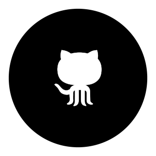

<h2>Welcome!</h2>

I'm an aspiring developer with knowledge in HTML, CSS, JavaScript, the MERN stack (MongoDB, Express, React, Node JS), Python and C#. I'm looking to work in this field permanently, and am currently studying for a BSc in Computing and IT.
 

I've revised this website from a distracting, visually noisy jQuery-backed mess into something that is hopefully a little more streamlined, simple and makes better use of pure JS. You could say this has been something of a UX learning experience.

 To gain some experience, for a limited time, I may be able to provide web development services free of charge. This does partly depend on the scope of the project, however. Please send me a message below explaining your needs and I will see how I can help.
 

<h2>Contact</h2>

<a class="navA" href="mailto:timothy.david.new@hotmail.co.uk">

<h2 class="h2Index">timothy.david.new@hotmail.co.uk</h2>

</a>

 Call me somewhat behind in the times, but I’ve yet to progress past the stage of relying on anything other than email for communication over the internet. My longest exposure to social media was back in the mid-2000s with Myspace for all of a month. Some day I’m sure I’ll have to get with the times, but until then I’m holding out on email.
 

 Feel free to send me a message on the address above. I’ve maintained the same Hotmail account for years on end now in the hopes that Microsoft might re-introduce MSN messenger one day (I can’t be the only one, right?)

<h2>Collaboration</h2>

<a class="navA" href="https://github.com/tdmnew?tab=repositories">

<h2 class="h2Index">GitHub</h2>

</a>

 Being an entirely self-taught programmer makes you run the risk of getting bad habits engrained in you from an early stage. I myself have no doubt committed a great many programming faux-pas in recent history. That’s why I’m looking to share my work with others in the hopes that I’ll be able to grow and improve.

 I’d appreciate any feedback on my work (Which means I plan on doing a better job of using my GitHub). Further, if you have any projects you need help on, I’d love to hear what you’re working on.

