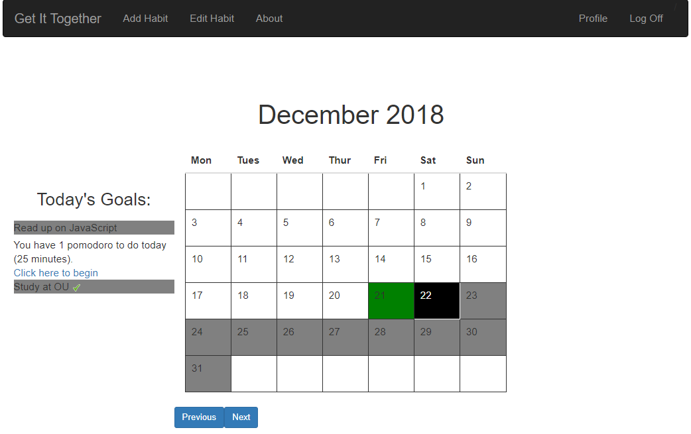

<h2>Projects</h2>
<h3>Get It Gogether</h3>

Get It Together was the first full-scale app I ever worked on. This was my final project for [CS50](https://www.edx.org/course/cs50s-introduction-computer-science-harvardx-cs50x). At its core, it's a habit tracker and a calender, but with a few other features thrown in here and there.

The project ended up taking much longer than anticipated because I got it in my head that I had to do everything myself (Such as routing) without any pre-built solutions. I ended up meeting several roadblocks because I wasn't nearly versed enough in a particular subject to proceed. Needless to say, I have a deeper understanding of why front-end development and back-end development are categorised as two separate disciplines entirely. 

I followed [Traversy Media's Udemy Course](https://www.udemy.com/mern-stack-front-to-back/) at the beginning of my project, but eventually decided to go it alone for the rest of the project. I have doubtless committed a few anti-patterns here and there. I found it interesting to see my skills progress as more components were added, in that my code became more readable and made better use of ECMAScript 6 syntactic sugar. 

The project was hardly ambitious, didn't stick to schedule and has some ugly code here and there, but I'm still immensely proud of the work I did. I started the project pretty much clueless with little conceptual understanding of things like state management, and ended it understanding how all of the elements of my application coalesce and developed a more reasoned approach to finding errors and correcting them. 

I'm looking to port this to Electron to create a desktop app as I can't find any reliable Node JS hosting for free.

<h3>Chalet Toit Rouge</h3>

This was my first attempt at building a [‘brochure’ website](http://www.chalettoitrouge.fr). I wanted to use this as an opportunity to build upon my CSS skills. I made extensive use of linear gradients for background images, which became a real hassle when trying to get the font to contrast well.

There wasn’t a great deal of turnaround time to design the site (Fortunately the client had an excellent library of images for the property, streamlining the whole process), but it did take some time to make the site responsive. I committed the sin of designing for desktop first, mobile second.

This is also the first site to be hosted on my own server, and not some third party. Hurray!

